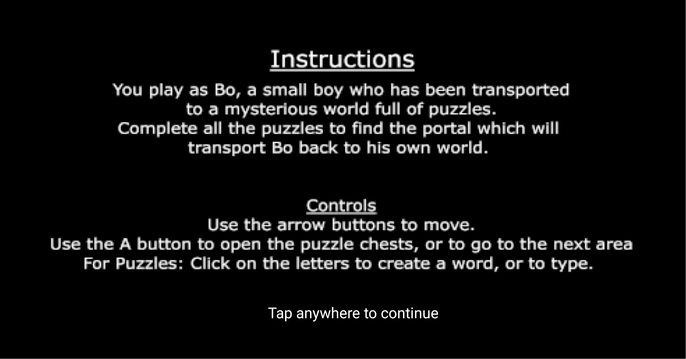
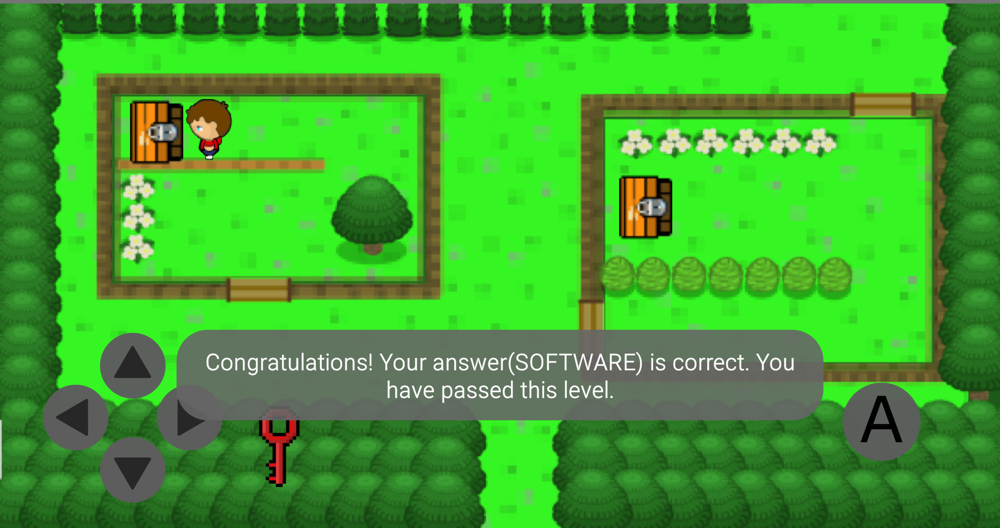

# AssignApp2019s1

# App - _Bo's Puzzle World_

## Team structure and roles 
+ Yishun Shi u6598369 - Puzzle levels, Setting, Timer, Maintain wiki and milestone
+ Natalie phan u6671390 - Storyboard, Items, Controls, Instructions & Information, Music

## App Overview
_The App contains various types of puzzles which all link to a story. The puzzles must be completed to progress in the story and within each puzzle there are items which are need for the next puzzle, or next activity.

_The story takes form in a rpg-style game, the main character will encounter puzzles whilst in the world and must complete the puzzle in order to continue_

_The story is about a boy named Bo who is whisked away into a world full of puzzles. Bo must navigate within the world in order to find a complete all the puzzles and collect pieces(or rewards) to finish the game and return back to his own world._

_The App contains puzzles need to be completed to progress in the story._

_The following are screenshots from the App:_

## Design Documentation 
+ [Design Summary](designsummary.md)
+ [Testing Summary](testingsummary.md)

## Minuted Meetings
+ [Meeting 1 - 26/04/2019 - decide team structure and app, divide up tasks](meeting1.md)
+ [Meeting 2 - 03/05/2019 - communicate with each other's progress](meeting2.md)
+ [Meeting 3 - 16/05/2019 - show each person's own completed parts and combine them into a complete APP](meeting3.md)
+ [Meeting 4 - 23/05/2019 - review and test](meeting4.md)

## Statement of Originality

I _Yishun Shi_ declare that everything I have submitted in this
assignment is entirely my own work, with exceptions given below.

I _Natalie Phan_ declare that everything I have submitted in this
assignment is entirely my own work, with exceptions given below.

### Inspiration

_The idea of the app is from a popular puzzle game Words Story - Addictive Word Game, the idea of the story is from the famous Pokemon Game_

### Code

_We use some code provided in this course (like parse, token etc.)_

_https://stackoverflow.com/questions/10407159/how-to-manage-startactivityforresult-on-android_

_https://stackoverflow.com/questions/17864143/single-method-to-implement-ontouchlistener-for-multiple-buttons_

_https://stackoverflow.com/questions/8209858/android-background-music-service/8209975#8209975_

### Assets

_https://incompetech.com/music/royalty-free/index.html?isrc=USUAN1500073&Search=Search_

_The pictures used in the game are made by ourselves using Photoshop._

